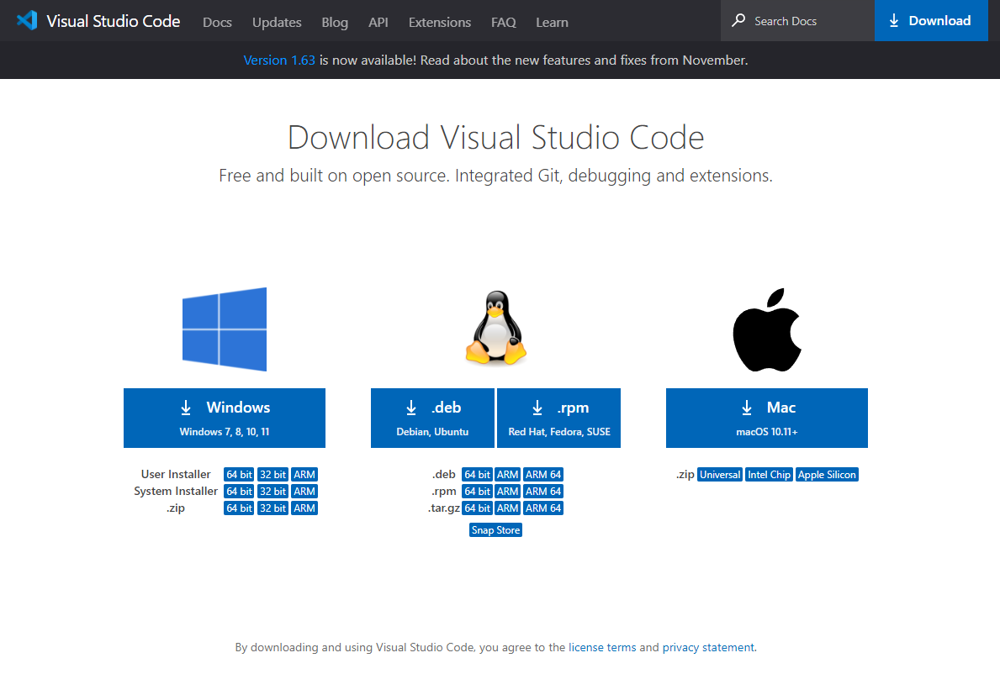
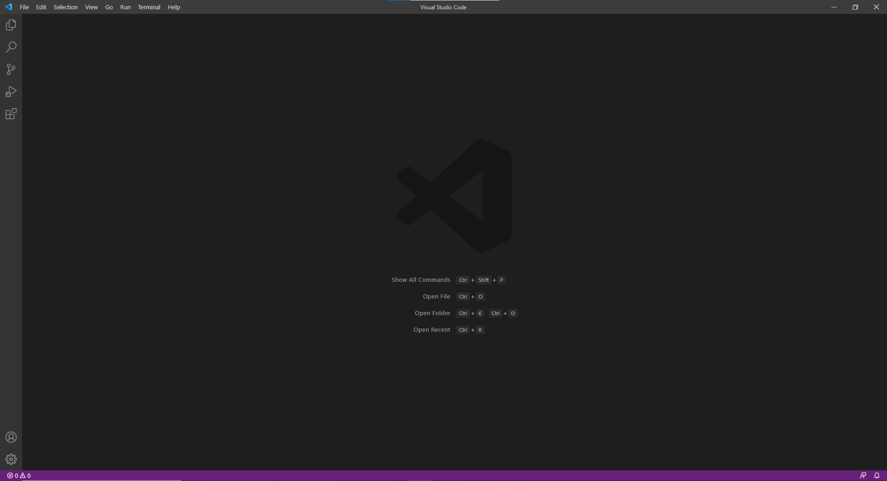
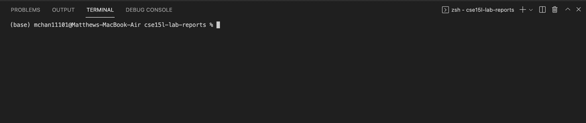
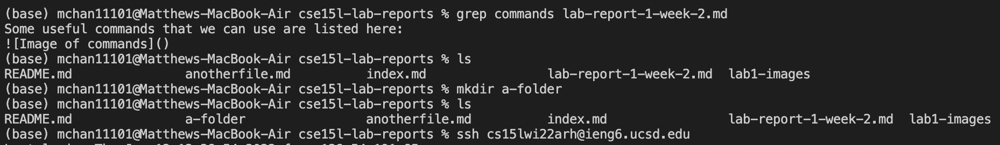
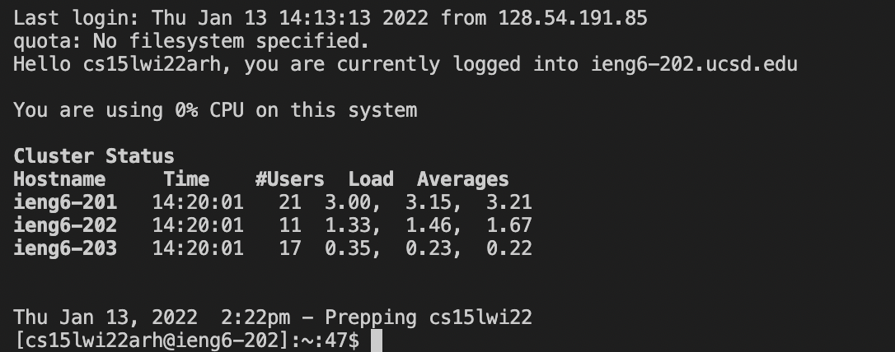
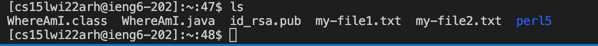
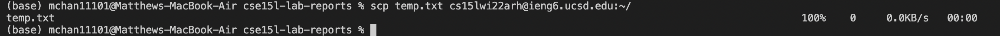
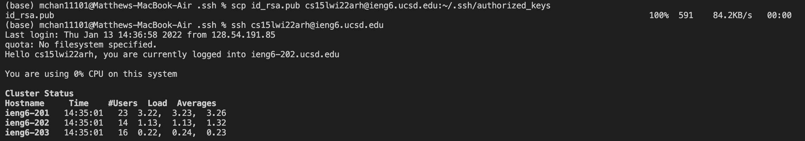
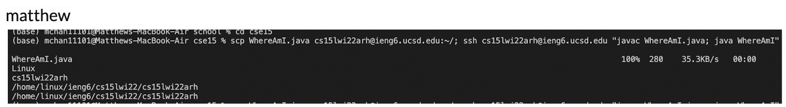

# Lab Report 1, Week 2.
You will write a tutorial for incoming 15L students (and your future self!) about how to log into a course-specific account on ieng6. Your post should include the steps you took, along with screenshots of what each step looked like. You’re free to use the screenshots you took for lab 1, or new ones. Complete any steps you didn’t complete in your group on your own.

Overall, make sure you have at least 6 screenshots, one for each of the steps below (though more is useful, remember that this will help out your future self). For each step include 2-3 sentences or bullet points describing what you did.

## Installing VScode
First, download the VSCode installer for whichever platform you will be using, from the official [VSCode website](https://code.visualstudio.com/Download). 

After running through the installer and all of the steps it tells you to do, you should be able to launch the application. At this point, you will be greeted with a mostly-blank screen which should look something like this:


## Remotely Connecting
First, we should open the terminal. This can be done by either clicking (on the top bar) `terminal`->`new terminal` or by using the keyboard shortcut `ctrl`+`shift`+`grave` which works on both Windows and Mac.

A bar will pop up at the bottom, which is the terminal. Depending on whether you use a Mac or a Windows machine, it may look a little bit different from the screenshots (all the following screenshots will have been run on a Mac device).

## Trying Some Commands
Some useful commands that we can use are listed here:
```
grep <phrase> <file>
	returns the line at which the phrase appears in the file
ls
	lists all of the files in the directory that are not hidden
mkdir <name>
	make a directory called name
ssh <address>
	uses secure shell to connect to a server
```

## Moving Files with scp
First, we need to know that we are able to SSH onto the remote device first. We can use the command `ssh <address>` to connect to the remote machine. You will be prompted for passwords, and after entering them, there will be a result that looks something similar to this:

Say we have some files we want to move over to that device. As of now, the home folder of your account on that device may have nothing (mine has a few items on it right now). 

We may have a file, for example temp.txt, that we want to move over from your local machine to your remote machine. Exit the remote machine with `exit`. 
SCP the file over (secure copy) to your remote machine with the command `scp <file name> <remote account>`

If we SSH back, we can see that it is there:

## Setting an SSH Key
Typing in your password this many times is getting a bit annoying. We can remedy this by adding our SSH key to the remote device. On your local device, use `ssh-keygen` to create an ssh key if you don't have one already, else find it in the folder `.ssh` in your user's root directory. The file will end with the extension `.pub`. Scp the file over to the remote device's `.ssh`folder; I'd do it like this:
```scp id_rsa.pub cs15lwi22arh@ieng6.ucsd.edu:~/.ssh/authorized_keys``` What this does is it copies it to folder `.ssh` and renames it `authorized_keys`.

If I login to the remote machine, I'll instantly notice that it was instant - no passwords required.
## Optimizing Remote Running
We can combine some commands into a single line by using some tricks.
For example, we can use the semicolon `;` to use two commands in one line. In addition, we can put commands after the SSH connect command to just execute the command and quit. We can combine this to run multiple commands on the remote machine and just quit afterwards like so:

