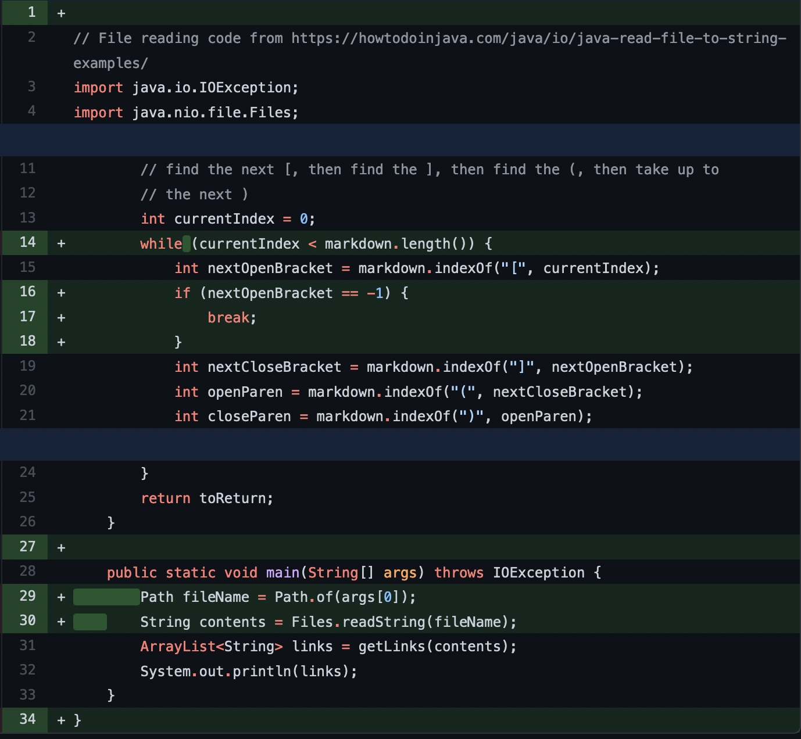
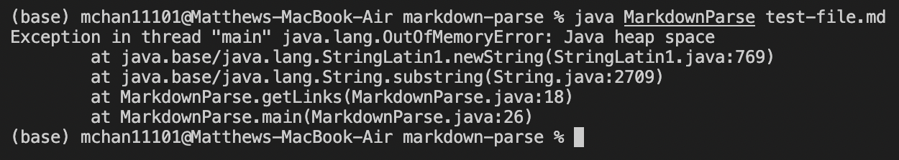
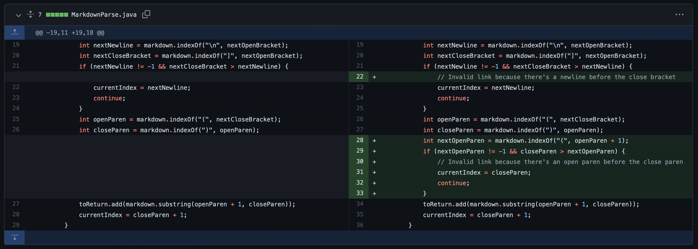
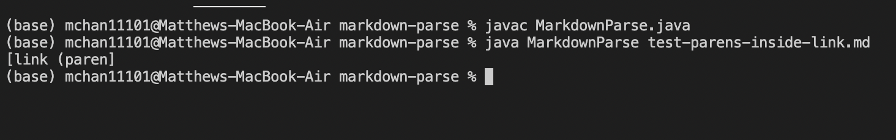
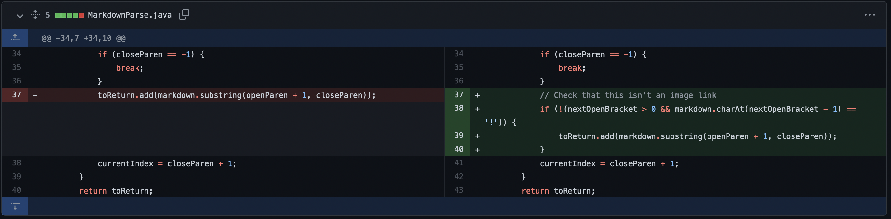
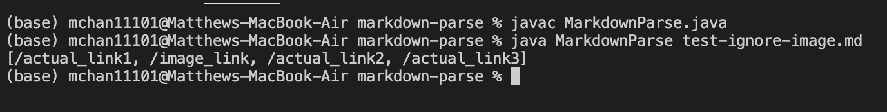

# Lab Report 2, Week 4.

Below, I will pick three code changes that my group worked on in order to fix a 
bug; these were stored on 
[Jared's repo](https://github.com/jared-hughes/markdown-parse) which I pulled and
merged into my own for this lab report. 

To get the images of the symptoms of the failure-inducing input, I revert back to
previous versions of the Java file with `git checkout <commit hash>`

## Issue 1: The Infinite Loop
### The fix


### The input
[test-ending-text.md](https://github.com/mac010ucsd/markdown-parse/blob/9046bc5270d453df84ef0a021d05c04f05c04859/test-ending-text.md)
```
# This file has extra text at the end

[a link!](https://something.com)
[another link!](some-page.html)
Blah blah
```

### The symptom


The bug was that the file simply did not end - if the last character in the md 
file was not the `]` character closing a link, the program would have an infinite 
loop due to the while loop not terminating. The variable `closeParen` would 
return the value `-1` while the current index was always set to equal to the 
value of `closeParen + 1`, which meant that the current index would never equal 
the length of the md file if the file did not end with `]`. The symptom which this 
caused was an OutOfMemoryError exception appearing in the console during runtime.
The failure inducing input was the file ending with a newline or any other 
character (or the string of characters "Blah blah" at the end here).

## Issue 2: Parentheses inside Parentheses
### The fix


### The input
[test-parens-inside-link.md](https://github.com/mac010ucsd/markdown-parse/blob/9a9fc400b281c8db8a18160cfeced37f173b4521/test-parens-inside-link.md)
```
# Parenthesis inside link text

Link: [Example](link (paren) ee )
```

### The symptom


The bug was that we did not account for parentheses hiding within the links in 
the markdown file. As a result, the link is truncated at the closing parenthesis
character `)`. The symptom from this would be the full link `link (paren) ee ` 
gets truncated to `link (paren`. The input that caused this symptom would be 
any link with a `)` character within the link, such as what we did with
`link (paren) ee `. I think this is a case where we can just assume that doing 
this would not be necessary as I don't really think many links have that specific 
character. 

## Issue 3: Images Being Linked
### The fix


### The input
[test-ignore-image.md](https://github.com/mac010ucsd/markdown-parse/blob/b087ed00a86d2d072e71a8b427ebec9a5c841030/test-ignore-image.md)
```
# Test ignore image

[Link test1](/actual_link1)
Image: 
[Link test2](/actual_link2)
Image2: 
```

### The symptom


The bug was that we did not check if the link was an image or not. The resulting 
symptom from this was that we would get links to images in our output list, which
was not desirable and did not follow the original prompt. We could see this by
the String in the resulting list `/image_link`.
The input resulting in 
this symptom was just having a `!` before the link brackets, in this case, the 
line ``
