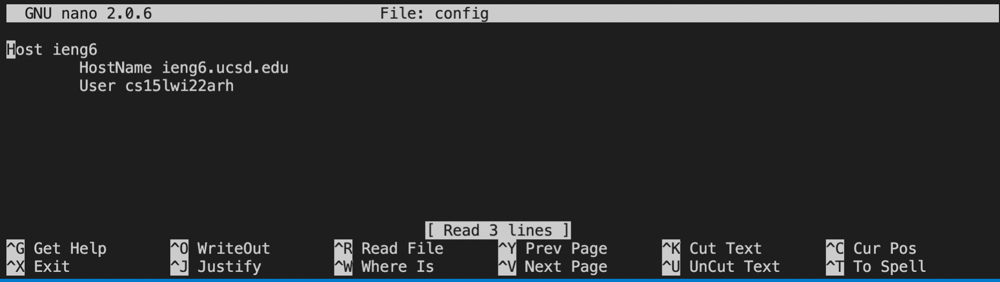
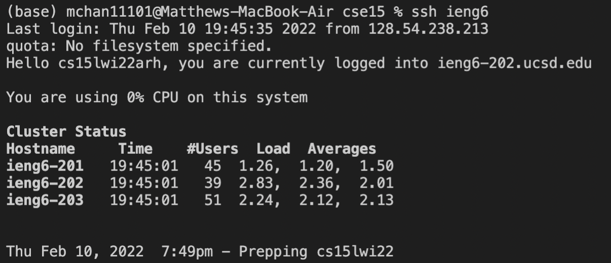
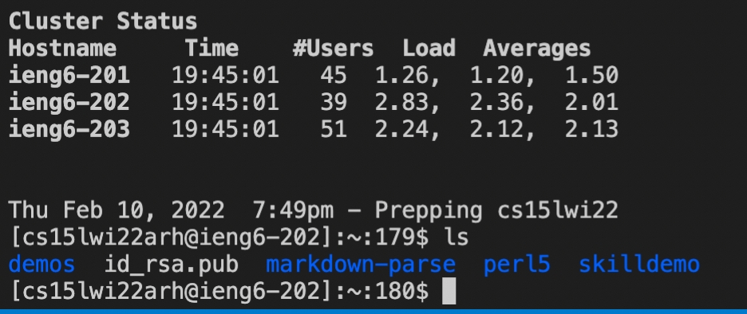
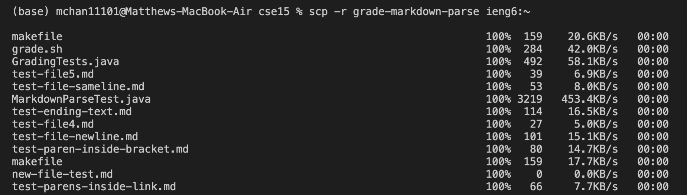
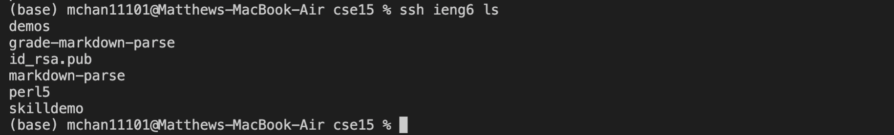

# Lab Report 3, Week 6.

## Streamlining ssh Configuration

This lab report will be on streamlining ssh connections from my computer (the client) to
the ieng6 computers (the server).

## Show your .ssh/config file, and how you edited it (with VScode, another program, etc)

I edited my config file via nano in the terminal. First, I cd'd into the .ssh directory by 
`cd ~/.ssh/`. By using `ls -a` I could see that there was no config file existing already. To 
create the file I did `nano config` and wrote down the code that was provided on the cse15l 
webpage. I saved the file with the shortcut `ctrl o`.  


## Show the ssh command logging you into your account using just the alias you chose.

To ssh into my account, I can now do `ssh ieng6` as that was the "host" I declared in the 
config file. Doing this allows me to skip all the stuff such as writing in the user@hostname, making
the whole process much faster. 


## Show an scp command copying a file to your account using just the alias you chose.

Since I am already logged into the remote, I will do `ls` to show the current files I have 
in my home directory. 



Leaving the remote by `exit`, I will now scp some files over via the command 
```
scp -r grade-markdown-parse ieng6:~
```

And then
```
ssh ieng6 ls
```
to show that the file(s) have been moved.

