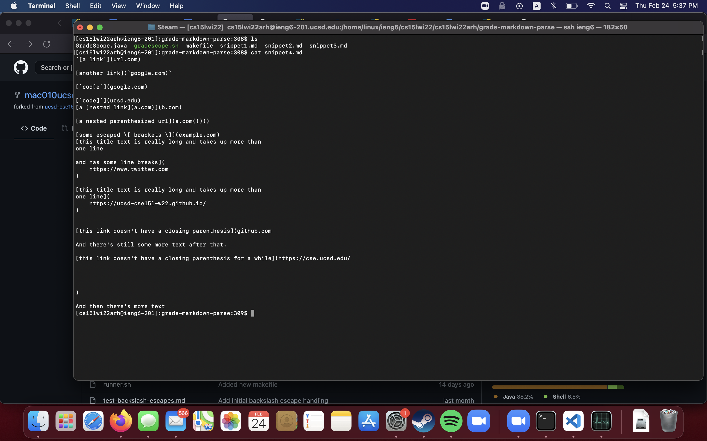
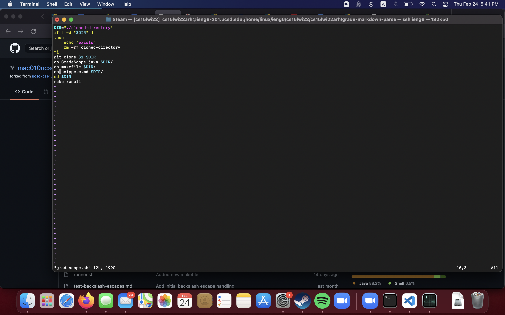
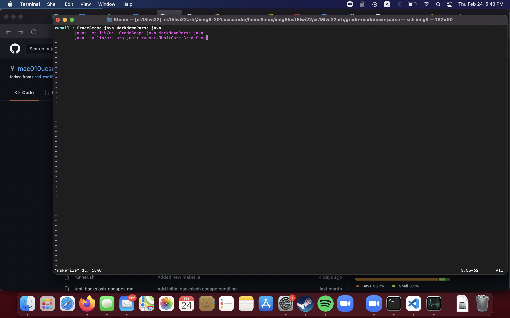
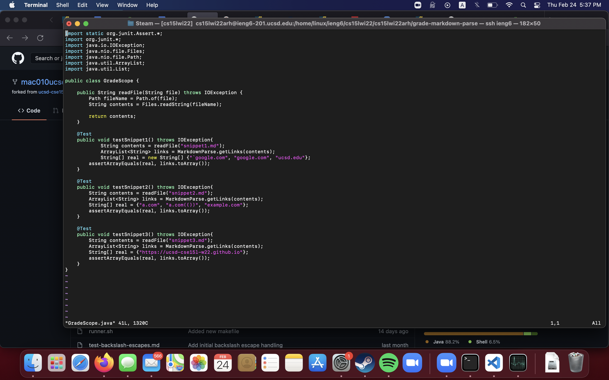
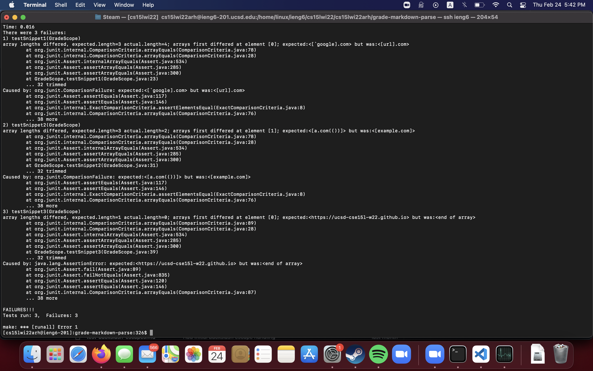

# Lab Report 4, Week 8.

## Repos Used:
Mine: [mac010ucsd](https://github.com/mac010ucsd/markdown-parse)

Theirs: [m1ma0314](https://github.com/m1ma0314/markdown-parse)

## Snippets.
I will be looking at the snippets in Commonmark's DINGUS markdown previewer/renderer. 
### Snippet 1:
```
`[a link`](url.com)

[another link](`google.com)`

[`cod[e`](google.com)

[`code]`](ucsd.edu)
```
Putting this in commonmark.js' DINGUS, we get the links
```
`google.com

google.com

ucsd.edu
```
### Snippet 2:
```
[a [nested link](a.com)](b.com)

[a nested parenthesized url](a.com(()))

[some escaped \[ brackets \]](example.com)
```
Putting this in commonmark.js' DINGUS, we get the links
```
a.com

a.com(())

example.com
```
### Snippet 3:
```
[this title text is really long and takes up more than 
one line

and has some line breaks](
    https://www.twitter.com
)

[this title text is really long and takes up more than 
one line](
    https://ucsd-cse15l-w22.github.io/
)


[this link doesn't have a closing parenthesis](github.com

And there's still some more text after that.

[this link doesn't have a closing parenthesis for a while](https://cse.ucsd.edu/


)

And then there's more text
```
Putting this in commonmark.js' DINGUS, we get the links
```
https://ucsd-cse15l-w22.github.io/
```
Something i'd like to point out is that using VSCode's markdown renderer gets us the following links:
```
https://www.twitter.com

https://ucsd-cse15l-w22.github.io/

https://cse.ucsd.edu/
```
I put the snippets in markdown files named 
```
snippet1.md
snippet2.md
snippet3.md
```
and their contents look like:



## The Test.
Gradescope, but better.

Bash file:


Makefile:


MarkdownParseTest (named GradeScope)


I run the tests by using the command `./runner.sh <repository_link>`

## The Test(s).
My implementation:


Their implementation:


Funnily enough, both of our implementations failed on all 3 snippets. For snippet2, our group's version was missing a link as we had 2 links instead of 3. The missing link was `a.com(())` while their group had 3 links but their `a.com(())` link was wrong. Neither of our groups found any links in snippet3.

## Can it be fixed?

### SNIPPET 1 ISSUES

inline code with backticks.

We get the output running snippet 1:
```java
[url.com, `google.com, google.com, ucsd.edu]
```

Case 1: Backtick before open square bracket ``` `[ ``` should invalidate link. Since we have code that checks for an exclamation mark, we can ignore this open square bracket as if it were an exclamation mark. This would remove the issue with `"url.com"` being present. The change: 

```java
markdown.charAt(nextOpenBracket - 1) == '!' 
``` 
to 
``` java
(markdown.charAt(nextOpenBracket - 1) == '!' || markdown.charAt(nextOpenBracket - 1) == '`') 
``` 
For these test cases, this should fix the one case which the code differs from the expected output in. This could easily be done within 10 lines (just change one line).

### SNIPPET 2 ISSUES

```java
[a.com, example.com]
```
So, we're missing the link `"a.com(())"`. This means we have problems with parenthesis inside link contents. We don't have issues with backslashes though.

My guess to how we fix this is that we create a stack-like structure. We add to the stack whenever we see an open parentheis, and when we come across a close parenthesis, we pop and check if the brackets (the item we just popped and the nextbracket) are of opposite directions. Once we reach `(a bracket which doesnt match || stack.length == 0)`, we know the link has ended at the index we just traversed across. Thus, we have successfuly gotten the substring which contains the link contents. (THIS IDEA WAS STOLEN FROM CSE12)

Alternatively, it could be done by using a running count for `(` and `)`. We iterate across the string indices. Once the count of closeParenthesis equals openParenthesis, we can consider the link closed. 

I think I could implement this fix in under 10 lines with the parenthesis counting method.

### SNIPPET 3 ISSUES

Our output:
```
[]
```

Let's look at commonmark's Markdown implementation as it appears to be more "strict" or "dumb" in terms of what it considers to be a link. We're just missing one link then - `https://ucsd-cse15l-w22.github.io/`. The rule appears to be:

1. 1 newline allowed in the link description.
2. That's all?

Well, given this test case, that's all. The primary thing we'll need to fix is the fact that we're looking for links in a line-by-line basis in MarkdownParse. The way our program works is that we split the input string at every `\n` and search for "link"s in each split. If we search for links in the file as a whole, we might have to rewrite a few lines but nothing would really break. 

Afterwards, we could do `indexOf("\n", openBracket).equals(lastIndexOf("\n", closeBracket))` where it would evaluate true if there is only one or none `\n` in the link description. We could also just iterate through the string between the closeBrackets and count the number of `\n`s. This would fix it for the commonmark.js implementation but likely wouldn't work for the VSCode version. 

For the VSCOde version, it would allow any number of `\n`s, at which point we should just take the extracted link and purge the `\n`s. 

Both fixes would likely take below 10 lines to implement, but the problem is - which standard should we be building our MarkdownParse to cater towards? When two implementations are conflicting our program cannot work equally well for both of them, which creates a problem.

# FIN.