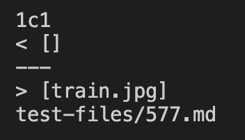
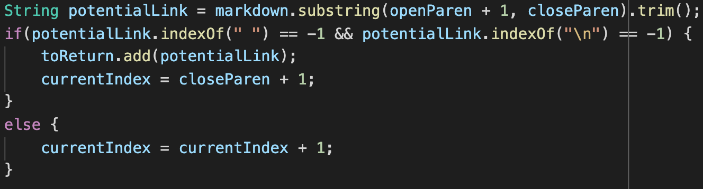
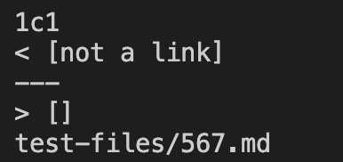
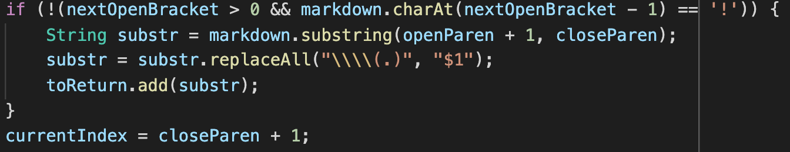

# Lab Report 5, Week 10.

## Intro
In Lab 9, we experimented with the commonmark tests. Here, I will be choosing
2 tests where our two implementations differ. The tests with different answers 
correspond to different bugs such that we couldn't fix both with 
one code change.

## Repos Used:
Mine: [mac010ucsd](https://github.com/mac010ucsd/markdown-parse)

Theirs: [jpolitz](https://github.com/ucsd-cse15l-w22/markdown-parse)

## How it was done
I found the tests with different results with a script I wrote utilizing
`diff` and status code `$?` to find which files had a difference. The script
is as follows:

```sh
rm diff_files.txt

for file in test-files/*.md;
do
  java MarkdownParse $file > $file.result
  java MarkdownParseOther $file > $file.result_other
  diff $file.result $file.result_other
  if [ $? -eq 1 ]
  then
    echo $file
    echo "\n"
    echo $file >> diff_files.txt
  fi
done
echo "\nDone. Files differing:"
echo $(grep -c ".*\.md" diff_files.txt)
```

I named my markdownparse implementation `MarkdownParse` while the one provided
was named `MarkdownParseOther`. For each file we run these java programs on them,
redirecting the output to a file. I use `diff` to compare them. `diff` will give
exit code `1` if they are different, and `0` if they have no differences. This
is used with an `if` statement to avoid spamming me with the name of every
single file that we check. 

The `grep` command with the `c` tag counts the instances of the search string
in the file, giving me the number of files that we detected as differing. There
ended up being 24 test results differing.

## The tests

### Test #577



If we look at the markdown file, it only contains a single line, which is
```md

```
which parses as a BROKEN IMAGE HERE:


_EDIT: github pages does not produce the broken image icon but trust me the "link" is there_

The goal of the program is to extract links but not image links. Thus, the provided
 implementation fails in this respect. Our group's implementation does not include
  this image link, and thus is correct (for this test)

Looking into the JPOLITZ implemetation, the symptom is that it gives a link when it shouldn't.
 The bug is that JPOLITZ here does not write functionality to check for the exclamation point
  before the link begins. 



A way to fix this would be to check whether the substring at `nextOpenBracket-1` equals an exclamation point. If it does, we skip considering this "link" or indices as a possible link. 


### Test #567



If we look at the markdown file, it only contains 2 lines with content:
```md
[foo](not a link)

[foo]: /url1
```
which parses as something that is not a link below:
[foo](not a link)

[foo]: /url1

_EDIT: github pages considers it a successful link but neither vscode nor commonmark does._

Commonmark declares "links" with spaces within the link content that are not 
padding as invalid links. Thus, this is "not a link", and not a link. Our groups' implementation is flawed as it considers it a link.

The symptom for our group is that it counts as a link. The bug is that we did not check for spaces within the link content before fully confirming it as a link. 



A way to fix this would be to check whether there exists `" "` within the substring using indexOf. If there is, we will consider it a faux link. Additionally, we could add the functionality of removing padding from the link as the JPOLITZ implementation does so that it would not trigger on padding whitespace.
